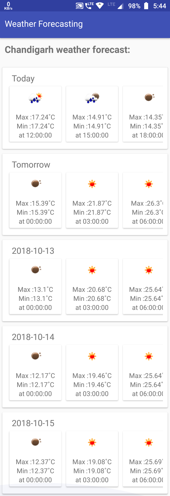

# WeatherForcast
To know the 5 days 3 hours interval weather for Chandigarh Location

This is the simple app for weather forcasting for static location i.e. Chandigarh. It will show the Min temp and Max temp
with date wise.

We are using openweathermap(https://openweathermap.org) api for weather information.
In this application is made in Kotlin language not in java and using multiple dependencies like retrofit, design support, and glide

screenshot below:

